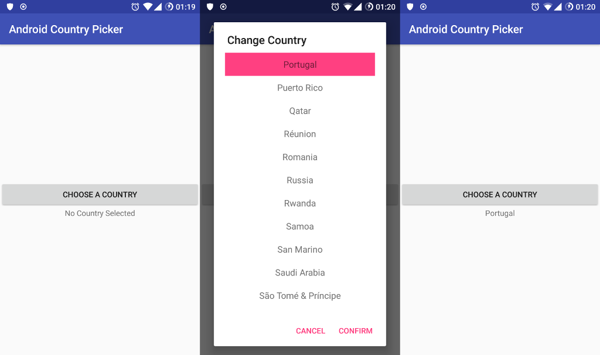

# Android Country Picker
Make a country picker without any external libraries! This project was based on some references from Stackoverflow and tiding up in a nice, easy to use, project.



## How it works
The "heart" of this project is the function `getCountryList()` in the `CountryPickerView.java`:

```java
private ArrayList<String> getCountryList() {
        Locale[] locales = Locale.getAvailableLocales();

        ArrayList<String> countries = new ArrayList<>();

        for (Locale locale : locales) {
            String country = locale.getDisplayCountry();

            if (country.trim().length() > 0 && !countries.contains(country)) {
                countries.add(country);
            }
        }

        Collections.sort(countries, new Comparator<String>() {
            @Override
            public int compare(String o1, String o2) {
                o1 = Normalizer.normalize(o1, Normalizer.Form.NFD);
                o2 = Normalizer.normalize(o2, Normalizer.Form.NFD);
                return o1.compareTo(o2);
            }
        });

        return countries;
    }
```

As it returns all available countries locales present in `Locale.class`, by alphabetic order (Even if there's special characters in the name, such as \`\'\^\~). Also, translations of the country names are handle by your current Android's OS Language automatically.

## Contribute
Feel free to improve the existing code and leave a star if you found this project usefull!
